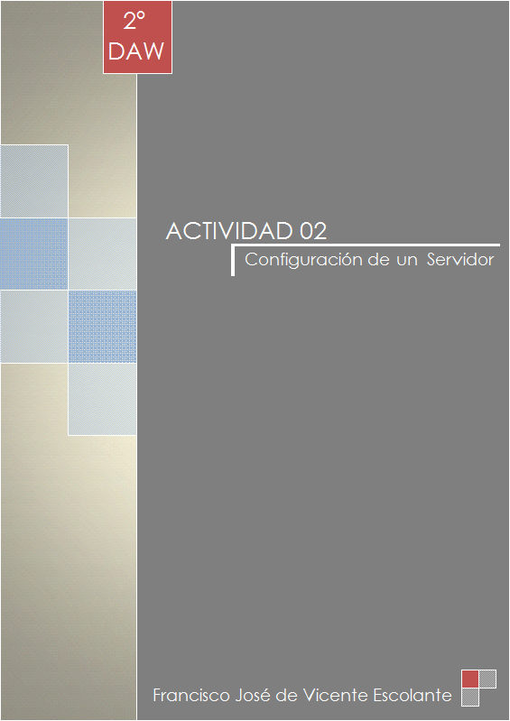

**Requerimiento 1:**

Queremos preparar nuestro servidor Linux para poder desplegar una aplicación web. Para ello, tenemos que verificar que están instalados:

1. Java
2. Apache
3. Tomcat
4. openSSH
5. MariaDB

**Requerimiento 2:**

Así mismo, queremos asegurarnos de que los servidores están bien configurados y son accesibles antes de desplegar la aplicación. Por ello debemos configurar y comprobar que los puertos asociados a Apache, Tomcat y MariaDB están abiertos en el Firewall y son accesibles desde el exterior.

# 01.- Java 

Java es muy funcional para crear aplicaciones y procesos o programas. Nos permite además ejecutar dichas aplicaciones después, en diversos Sistemas Operativos. 

Para instalar Java en un servidor de Linux, lo primero que tenemos que hacer es abrir nuestro terminal.

	- Podemos comprobar si ya tenemos instalado escribiendo el comando "java -version"
	
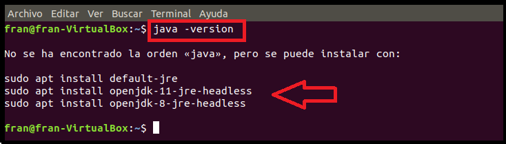 

El propio terminal nos informa que no ha encontrado ninguna versión y además, nos dice cómo poder instalarla. Para ello, como muestra en la imagen, tenemos que hacer el siguiente comando:

	- sudo apt install default-jre

**Nota** Nos puede pasar que, como en mi caso, nos solicite antes una actualización para poder usar apt-get y simplemente, acutualizamos como muestro en la siguiente imagen
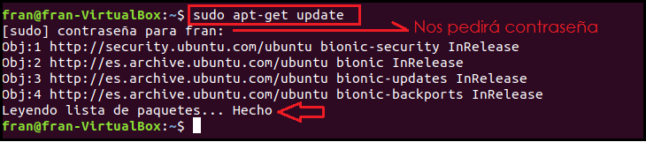

Hecha la actualización, procedemos a instalar java
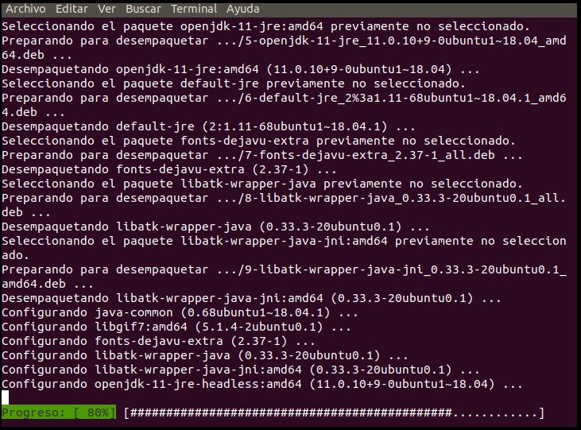 

**Nota:** Si queremos saber qué versión de java nos ha instalado, volvemos a ejecutar el primer comando (java -version) y nos aparecerá en la consola
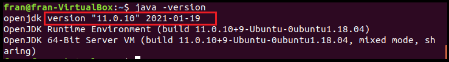

# 02.- Apache

Ahora que ya tenemos java instalado en nuestra máquina virtual, vamos a proceder a instalar Apache. 

Apache es servidor web de protocolo HTTP. Además de ser multiplataforma, tiene fuente o código abierto, y permite que los propietarios de sitios web, puedan servir contenido a los usuarios de sus páginas, a través de sus peticiones. 

Para instalar Apache en un servidor Linux, debemos usar el siguiente comando:

	- sudo apt install apache2

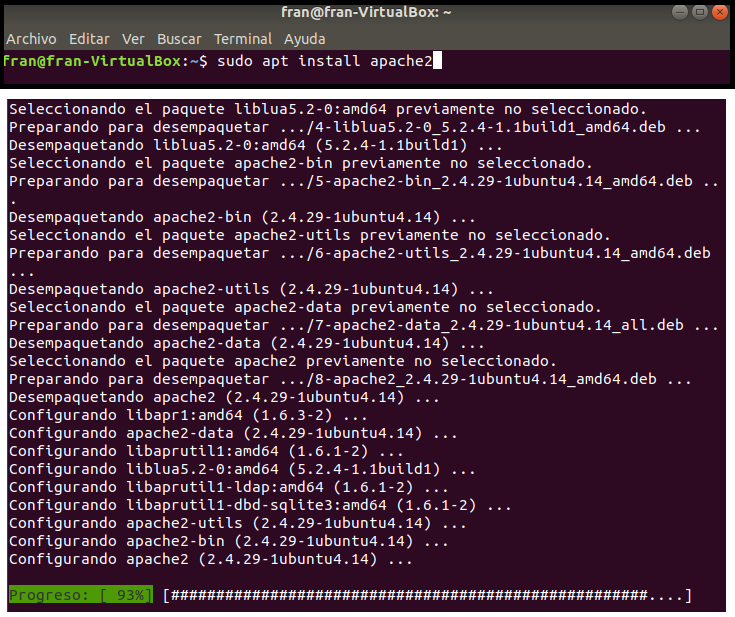

**Nota:** Podemos comprobar que nuestro apache está instalado, abriendo un navegador web y escribiendo "localHost". De esta manera, nos saldrá un certificado que nos indica que nuestro apache ha sido instalado correctamente.
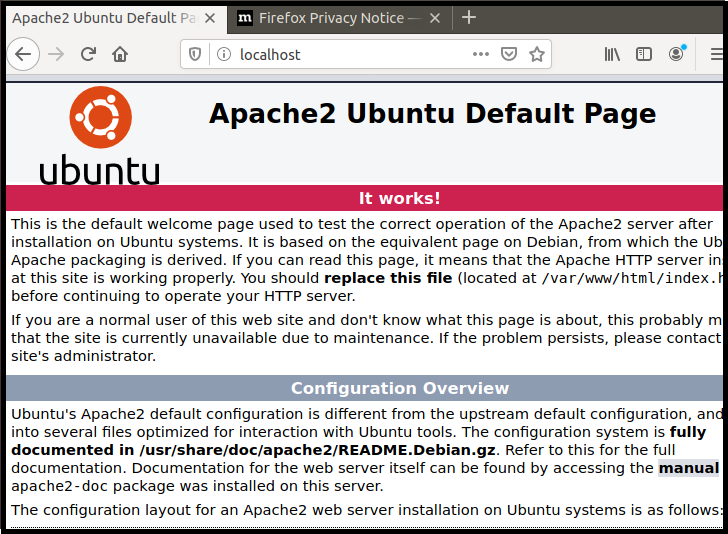

Ahora bien, cabe mencionar de que a pesar de que ya tenemos correctamente nuestro apache instalado, **tenemos que modificar el cortafuegos** para que los usuarios de fuera, puedan hacer peticiones a nuestro servidor. 

Para hacer estas modificaciones, hacemos los siguientes comandos.

	- sudo ufw app list  

Este comando es para visualizar los perfiles de aplicación que pueden utilizarse para el acceso. Hay 3 perfiles:

- **Apache:** que es el básico y va por el puerto 80. Sirve para el tráfico descifrado.
- **Apache Full:** abre además del puerto de Apache, el puerto 443 que es para tráfico cifrado (SSL/TSL)
- **Apache Secure:** este sólo abre el puerto 443

Nosotros, para éste ejercicio vamos a dar los permisos básicos de Apache,  que es el que nos marca el enunciado de la actividad, pero sabiendo que lo podemos hacer para cualquiera de los tres.

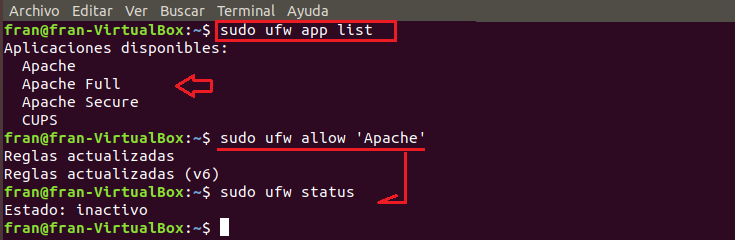 

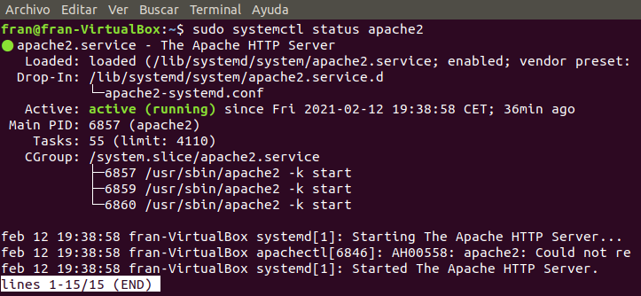

De ésta manera, ya tenemos nuestro Apache listo.

# 03.- Tomcat

A diferencia de Apache, Tomcat también es un servidor de Apache, pero puede ejecutar varias especificaciones diferentes de Java, como Java Servlet, JavaServer Pages (JSP), Java EL (Expresiones de Lenguaje) y WebSocket.

Para instalar Tomacat con nuestro terminal Linux, tenemos que hacer el siguiente comando:

	- sudo apt install tomcat9

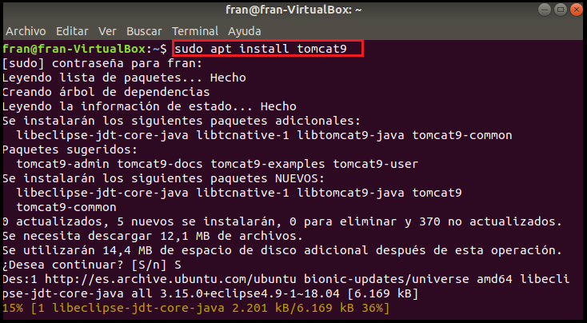

Podemos comprobar su estado usando el comando 

	- systemctl status tomcat9

Ahora, vamos a acceder al puerto de escucha, que es el 8080. Éste puerto, se puede modificar a nuestra necesidad modificando el archivo **sever.xml** 

	- sudo ufw allow 8080/tpc (para acceder al puerto de escucha)
	- sudo nano/etc/tomcat9/server.xml (para acceder al fichero)

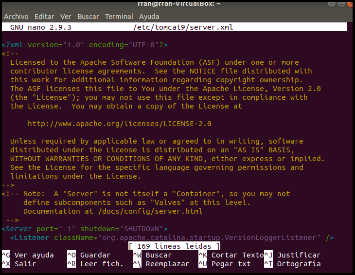

**Nota:** Algunas aplicaciones requieren acceso con contraseñas para dar roles como el de "manager-gui" o "admin-gui". Nosotros podemos crear usuarios y ponerles una contraseña dándole a su vez el rol que necesite.

Ahora, nosotros vamos a dar permisos a un usuario para que tenga rol de "manager-gui" y de "admin-gui" y para ello, tenemos que acceder al fichero **tomcat-users.xml** mediante el siguiente comando:

	- sudo nano /etc/tomcat9/tomcat-users.xml
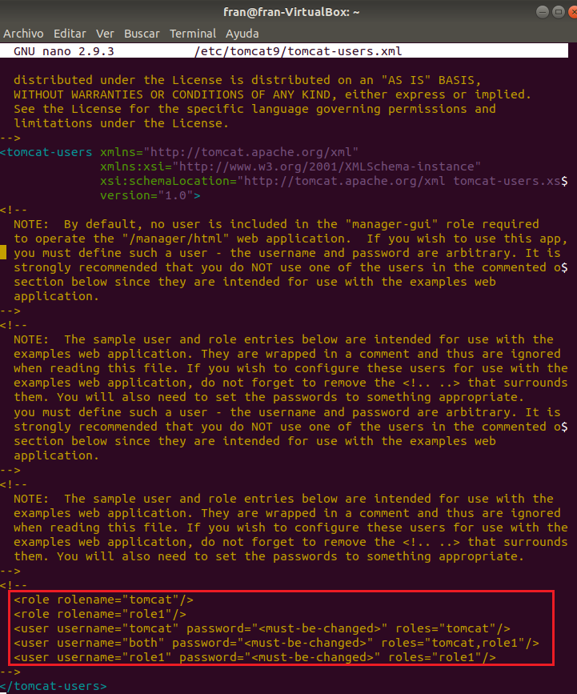

Para cambiar los roles, hay que seguir los siguientes pasos:

**Primero:** Hay que quitar los comentarios <!-- 
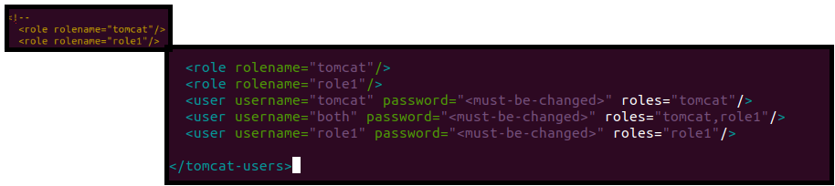

