**Requerimiento 1:**

Queremos preparar nuestro servidor Linux para poder desplegar una aplicación web. Para ello, tenemos que verificar que están instalados:

1. Java
2. Apache
3. Tomcat
4. openSSH
5. MariaDB

**Requerimiento 2:**

Así mismo, queremos asegurarnos de que los servidores están bien configurados y son accesibles antes de desplegar la aplicación. Por ello debemos configurar y comprobar que los puertos asociados a Apache, Tomcat y MariaDB están abiertos en el Firewall y son accesibles desde el exterior.

# 01.- Java 

Java es muy funcional para crear aplicaciones y procesos o programas. Nos permite además ejecutar dichas aplicaciones después, en diversos Sistemas Operativos. 

Para instalar Java en un servidor de Linux, lo primero que tenemos que hacer es abrir nuestro terminal.

	- Podemos comprobar si ya tenemos instalado escribiendo el comando "java -version"
	
 

El propio terminal nos informa que no ha encontrado ninguna versión y además, nos dice cómo poder instalarla. Para ello, como muestra en la imagen, tenemos que hacer el siguiente comando:

	- sudo apt install default-jre

**Nota** Nos puede pasar que, como en mi caso, nos solicite antes una actualización para poder usar apt-get y simplemente, actualizamos como muestro en la siguiente imagen

Hecha la actualización, procedemos a instalar java
 

**Nota:** Si queremos saber qué versión de java nos ha instalado, volvemos a ejecutar el primer comando (java -version) y nos aparecerá en la consola

# 02.- Apache

Ahora que ya tenemos java instalado en nuestra máquina virtual, vamos a proceder a instalar Apache. 

Apache es servidor web de protocolo HTTP. Además de ser multiplataforma, tiene fuente o código abierto, y permite que los propietarios de sitios web, puedan servir contenido a los usuarios de sus páginas, a través de sus peticiones. 

Para instalar Apache en un servidor Linux, debemos usar el siguiente comando:

	- sudo apt install apache2

**Nota:** Podemos comprobar que nuestro apache está instalado, abriendo un navegador web y escribiendo "localHost". De esta manera, nos saldrá un certificado que nos indica que nuestro apache ha sido instalado correctamente.

Ahora bien, cabe mencionar de que a pesar de que ya tenemos correctamente nuestro apache instalado, **tenemos que modificar el cortafuegos** para que los usuarios de fuera, puedan hacer peticiones a nuestro servidor. 

Para hacer estas modificaciones, hacemos los siguientes comandos.

	- sudo ufw app list  

Este comando es para visualizar los perfiles de aplicación que pueden utilizarse para el acceso. Hay 3 perfiles:

- **Apache:** que es el básico y va por el puerto 80. Sirve para el tráfico descifrado.
- **Apache Full:** abre además del puerto de Apache, el puerto 443 que es para tráfico cifrado (SSL/TSL)
- **Apache Secure:** este sólo abre el puerto 443

Nosotros, para éste ejercicio vamos a dar los permisos básicos de Apache,  que es el que nos marca el enunciado de la actividad, pero sabiendo que lo podemos hacer para cualquiera de los tres.

 

De ésta manera, ya tenemos nuestro Apache listo.

# 03.- Tomcat

A diferencia de Apache, Tomcat también es un servidor de Apache, pero puede ejecutar varias especificaciones diferentes de Java, como Java Servlet, JavaServer Pages (JSP), Java EL (Expresiones de Lenguaje) y WebSocket.

Para instalar Tomacat con nuestro terminal Linux, tenemos que hacer el siguiente comando:

	- sudo apt install tomcat9

Podemos comprobar su estado usando el comando 

	- systemctl status tomcat

Ahora, vamos a acceder al puerto de escucha, que es el 8080. Éste puerto, se puede modificar a nuestra necesidad modificando el archivo **sever.xml** 

	- sudo ufw allow 8080/tpc (para acceder al puerto de escucha)
	- sudo nano/etc/tomcat/server.xml (para acceder al fichero)

**Nota:** Observamos que el puerto está indicado en el "-1" por lo que hay que cambiarlo al puerto 8080. Por otro lado, algunas aplicaciones requieren acceso con contraseñas para dar roles como el de "manager-gui" o "admin-gui". Nosotros podemos crear usuarios y ponerles una contraseña dándole a su vez el rol que necesite.

Ahora, nosotros vamos a dar permisos a un usuario para que tenga rol de "manager-gui" y de "admin-gui" y para ello, tenemos que acceder al fichero **tomcat-users.xml** mediante el siguiente comando:

	- sudo nano /etc/tomcat/tomcat-users.xml

Para cambiar los roles, hay que seguir los siguientes pasos:

**Primero:** Hay que quitar los comentarios <!-- 

**Segundo:** Añadimos los usuarios o modificamos los arriba indicados.
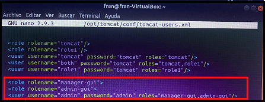

Paramos y arrancamos el tomcat para acceder al manager.

	- service tomcat stop  (parar)
	- service tomcat start (arrancar)

**Tercero:** Tenemos que editar el archivo de configuración **context.xml** para los permisos de la aplicación (no del tomcat). Podemos hacerlo mediante el siguiente comando:

	- sudo nano /usr/share/tomcat-admin/manager/META-INF/context.xml

Una vez accedido al archivo context, descomentamos el atributo "value"
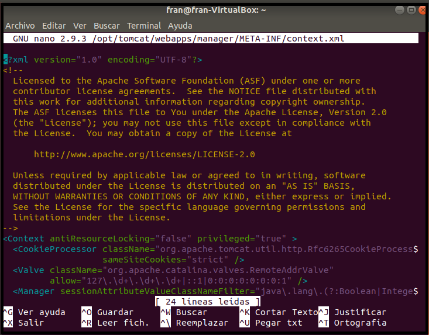

**Cuarto:** Repetimos el mismo proceso para el archivo **Manager**, usando el comando:

	- sudo nano /opt/tomcat/webapps/manager/META-INF/context.xml
	Nótese que hay que indicar la ruta correspondiente a la instalación del tomcat.

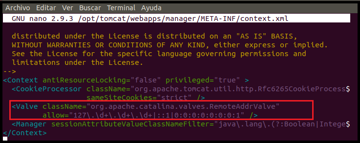

Por último, reiniciamos el servidor tomcat mediante el siguiente comando:

	- sudo systemctl restart tomcat

Una vez hayamos reiniciado el servidor, procedemos a intentar acceder a la página del tomcat http://localhost:8080 y nos deverá aparecer la siguiente pantalla:
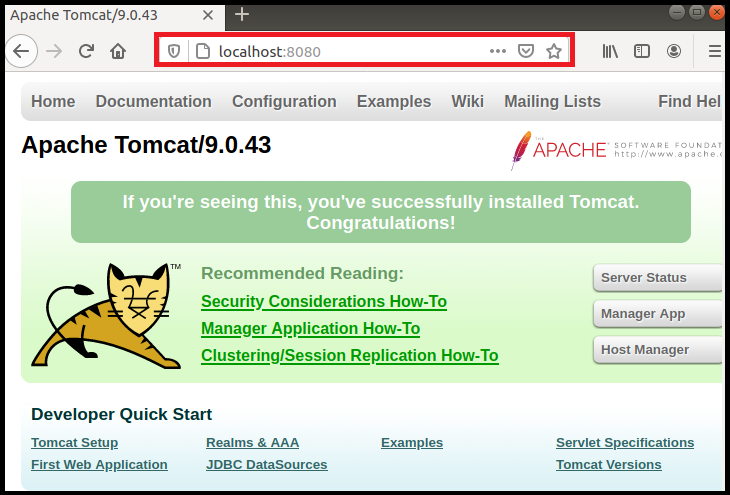

Una vez hemos comprobado que podemos acceder, pulsamos en la opción que nos sale "Manager App" como se muestra en la imagen anterior. Una vez pulsemos, nos pedirá la contraseña y el usuario que deberemos poner el que hemos creado en el archivo users.xml si es correcto, accederemos al servidor como se muestra a continuación:

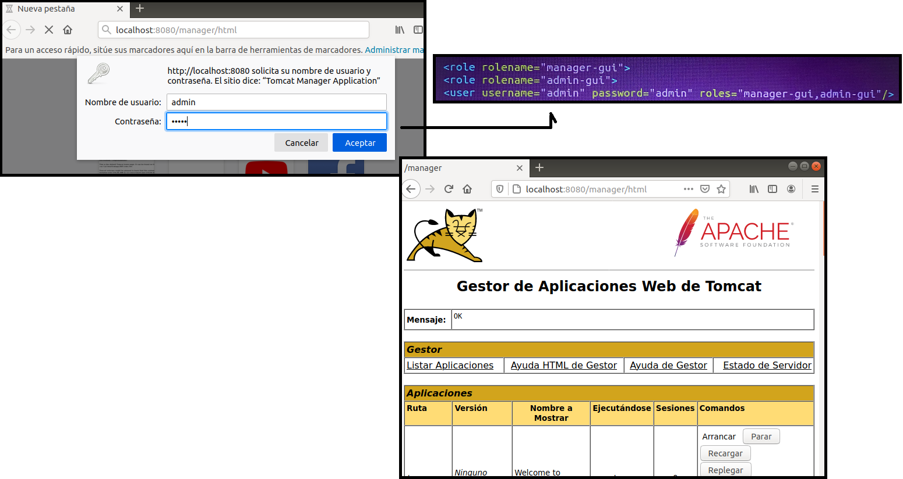

**Nota:** Podemos comprobar que funciona instalando más aplicaciones desde la pestaña **Deploy**, así como modificarlo o eliminarlo.

# 04.- Open SSH

**Secure Sell (SSH)**, nos deja acceder a una máquina remota de forma segura. **OpenSSH** son las herramientas basadas en éste protocolo. 

Vamos a instalar las herramientas tanto para el servidor como para el cliente en un sólo comando:

	- sudo apt-get install openssh-server openssh-client

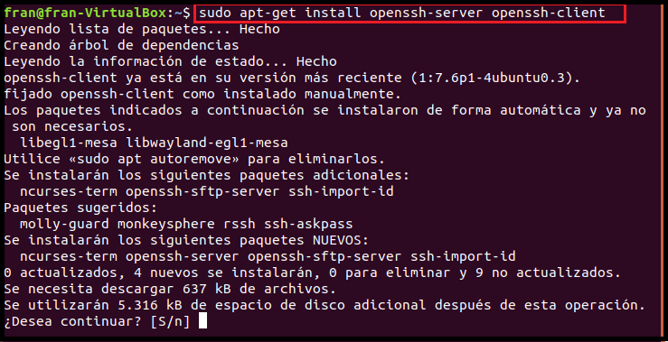

Una vez hayamos instalado openSSH, vamos a comprobar que funciona correctamente. Para ello, hacemos el comando

	- sudo systemctl status sshd.service

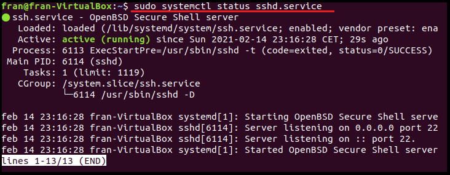

Ahora que hemos comprobado que el estado está activo, vamos a utilizar el comando **ifconfig** para averiguar la IP de nuestra máquina virtual como servidor y, habría que saber cuál es la IP del cliente.

Para usar SSH, hacemos el siguiente comando para enlazar con el servidor

	- ssh@ipServidor (en mi caso, sería:) ssh@10.0.2.15

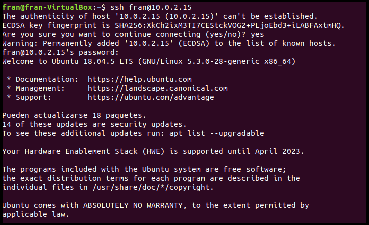

Ya podemos acceder al ordenador del cliente y hacer las transacciones correspondientes. Una vez las tengamos hechas, podemos salir ejecutando el comando exit.

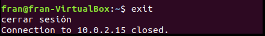

# 05.- MariaDB

MariaDB es una base de datos relacional de código abierto similar a MySQL. Para instalar MariaDB, utilizamos el siguiente comando:

	- sudo apt install mariadb-server

Cuando hayamos instalado mariaDB, podemos comprobar su estado mediante el comando

	- sudo systemctl status mariadb
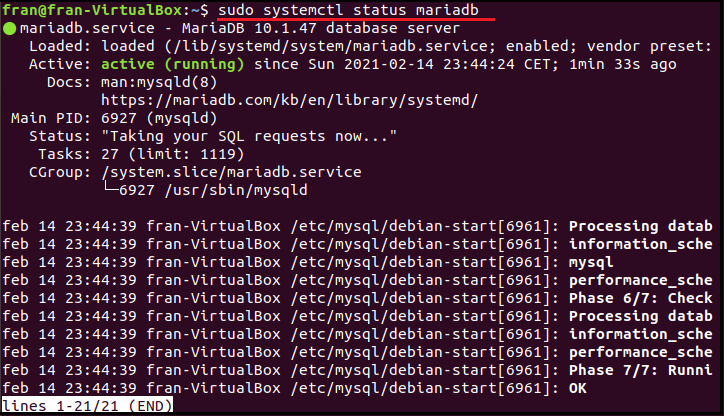

**Nota:** Podemos usar las herramientas de mysqladmin para establecer la conexión con la base de datos mediante el comando **sudo mysqladmin version**

Ahora comprobamos que los puertos están abiertos o "escuchando" mediante uno de los siguientes comandos:

	- sudo lsof -i -P -n
	- sudo netstat -plnut (sinónimo del anterior)

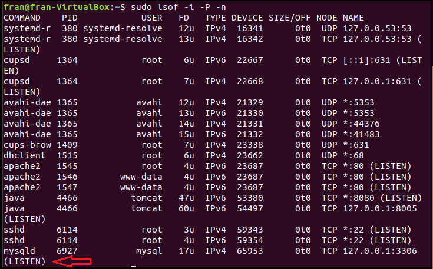

Por último, comprobamos la configuración del cortafuegos. Lo hacemos mediante el comando 

	- sudo ufw app list
	- sudo ufw status (para ver el estado)

**ufw** nos vale para abrir y cerrar los puertos de escucha que necesitemos. Se usan como interfaces de conexión para que las aplicaciones puedan establecer dicha conexión.

**Nota:** Si queremos ver todos los puertos, podemos utilizar el siguiente comando:

	- sudo netstat -tulpen

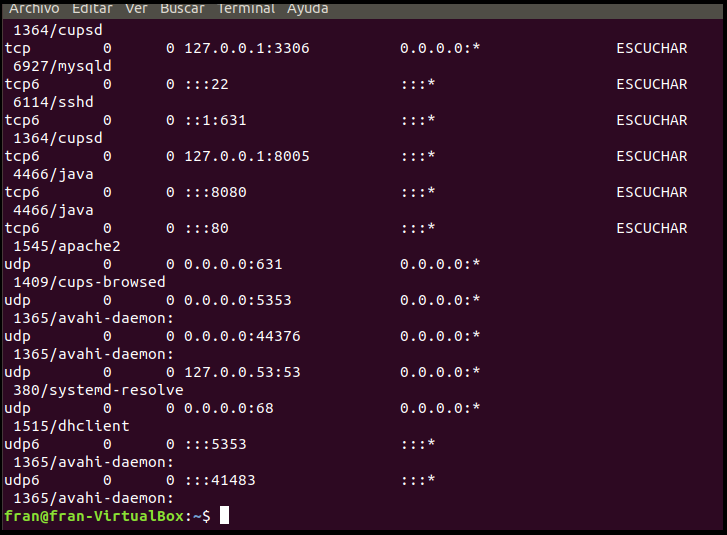

Podemos comprobar el estado del servidor, la BBDD y el firewall con los comandos mencionados anteriormente **sudo systemctl status nombreApp**